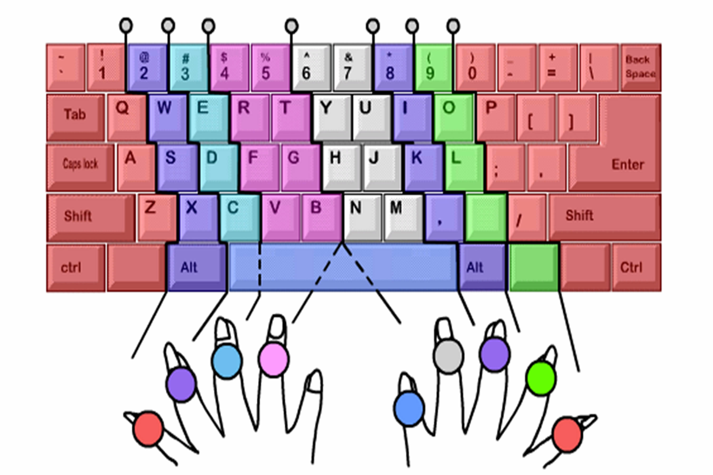

# 电脑快速操作技巧

你用电脑打字还眼睛盯着键盘用一两个手指敲，但见电脑高手眼睛看着屏幕，手指一阵噼里啪啦乱敲，文字唰唰唰快速显示出来，是不是很羡慕；

你想打开电脑里的某个文件打印，操作是用鼠标一个一个隐藏所有已经打开的程序，返回桌面找到 “我的电脑” 打开，再找到文件打开，再在文件中找到打印选项，但见电脑高手卡擦卡擦几个按键一敲，瞬间就将文件打印出来了，是不是很惊奇……

好了，这份手册就是帮助您成为电脑操作高手的。

## 快速操作的基础

要实现快速操作，最最基础的就是对键盘上每个按键的位置都非常清楚，以及手指能够不用眼看，不经思考瞬间找到相应按键敲下去，简单说就是实现**盲打**。

如何实现盲打呢？

把你的双手依照上图的位置轻轻放在键盘上，全身放松，不要僵硬。你的左手食指放在字母 F 上 (F 键上有一个小突起，我们通常称之为盲打坐标)，右手食指放在字母 J 上 (J 键也是一个盲打坐标) 然后将四指并列对齐分别放在相邻的键钮上。

然后按照上图熟记每一个手指的负责的键位。

接着就是绝对不看键盘，练习练习再练习…… 

如果手指的位置错位了，再回到盲打坐标继续练习…… 

每天抽几个小时时间练习，一个星期之后，由于肌肉记忆的力量，你就可以不用眼睛看，不经思考，手指自动找到相应按键按下去了。

提示：因为 CTRL，Alt 和 Shift 键，键盘两边都各有一个，特殊字符例如 `？`，左手小指按住 Shift，右手小指按 `？` 键即可。其他特殊字符类似。

有了盲打基础，其他快捷操作就水到渠成了，下面列出电脑操作的快捷键，查一查，练一练，就成为别人眼中的电脑高手啦。

## Windows 键盘快捷键

快捷键就是按键或按键组合，可提供一种替代方式来执行通常使用鼠标执行的操作。下面是 Windows 10 的快捷键，其他版本 Windows 系统基本与 Windows 10 一致。并不是所有快捷键都需要记住，我们只挑选自己最常用，最有用的即可。

### 复制、粘贴以及其他常规快捷键

- `Ctrl + X` 剪切选定项。

- `Ctrl + C（或 Ctrl + Insert）` 复制选定项。

- `Ctrl + V（或 Shift + Insert）` 粘贴选定项。

- `Ctrl + Z` 撤消操作。

- `Alt + Tab` 在打开的应用之间切换。

- `Alt + F4` 关闭活动项，或者退出活动应用。

- `Windows 徽标键  + L` 锁定你的电脑。

- `Windows 徽标键  + D` 显示和隐藏桌面。

- `F2` 重命名所选项目。

- `F3` 在文件资源管理器中搜索文件或文件夹。

- `F4` 在文件资源管理器中显示地址栏列表。

- `F5` 刷新活动窗口。

- `F6` 循环浏览窗口中或桌面上的屏幕元素。

- `F10` 激活活动应用中的菜单栏。

- `Alt + F8` 在登录屏幕上显示你的密码。

- `Alt + Esc` 按项目打开顺序循环浏览。

- `Alt + Enter` 显示所选项目的属性。

- `Alt + 空格键` 打开活动窗口的快捷菜单。

- `Alt + 向左键` 返回。

- `Alt + 向右键` 前进。

- `Alt + Page Up` 向上移动一个屏幕。

- `Alt + Page Down` 向下移动一个屏幕。

- `Ctrl + F4` 关闭活动文档（在可全屏显示并允许你同时打开多个文档的应用中）。

- `Ctrl + A` 选择文档或窗口中的所有项目。

- `Ctrl + D（或 Delete）` 删除选定项，将其移至回收站。

- `Ctrl + R（或 F5）` 刷新活动窗口。

- `Ctrl + Y` 恢复操作。

- `Ctrl + 向右键` 将光标移动到下一个字词的起始处。

- `Ctrl + 向左键` 将光标移动到上一个字词的起始处。

- `Ctrl + 向下键` 将光标移动到下一段落的起始处。

- `Ctrl + 向上键` 将光标移动到上一段落的起始处。

- `Ctrl + Alt + Tab` 使用箭头键在所有打开的应用之间进行切换。

- `Alt + Shift + 箭头键` 当组或磁贴的焦点放在“开始”菜单上时，可将其朝指定方向移动。

- `Ctrl + Shift + 箭头键` 当磁贴的焦点放在“开始”菜单上时，将其移到另一个磁贴即可创建一个文件夹。

- `Ctrl + 箭头键` 打开“开始”菜单后调整其大小。

- `Ctrl + 箭头键（移至某个项目）+ 空格键` 选择窗口中或桌面上的多个单独项目。

- `Ctrl + Shift（及箭头键）` 选择文本块。

- `Ctrl + Esc` 打开“开始”菜单。

- `Ctrl + Shift + Esc` 打开任务管理器。

- `Ctrl + Shift` 如果多种键盘布局可用，则可切换键盘布局。

- `Ctrl + 空格键` 打开或关闭中文输入法编辑器 (IME)。

- `Shift + F10` 显示选定项的快捷菜单。

- `按 Shift 与任何箭头键` 在窗口中或桌面上选择多个项目，或在文档中选择文本。

- `Shift + Delete` 删除选定项，无需先移动到回收站。

- `Esc` 停止或离开当前任务。

- `PrtScn` 捕获整个屏幕的屏幕截图并将其复制到剪贴板。 

### Windows 徽标快捷键

- `Windows 徽标键 ` 打开或关闭“开始”菜单。

- `Windows 徽标键  + A` 打开操作中心。

- `Windows 徽标键  + B` 将焦点设置到通知区域。

- `Windows 徽标键  + C` 在侦听模式下打开 Cortana。

- `Windows 徽标键  + Shift + C` 打开超级按钮菜单。

- `Windows 徽标键  + D` 显示和隐藏桌面。

- `Windows 徽标键  + Alt + D` 显示和隐藏桌面上的日期和时间。

- `Windows 徽标键  + E` 打开文件资源管理器。

- `Windows 徽标键  + F` 打开反馈中心并获取屏幕截图。

- `Windows 徽标键  + G` 打开游戏栏（当游戏处于打开状态时）。

- `Windows 徽标键  + H` 开始听写。

- `Windows 徽标键  + I` 打开设置。

- `Windows 徽标键  + J` 请将焦点设置到可用的 Windows 提示。当出现 Windows 提示时，请将焦点移到提示上。再次按下键盘快捷方式，将焦点放在屏幕上 Windows 提示所固定的元素上。

- `Windows 徽标键  + K` 打开“连接”快速操作。

- `Windows 徽标键  + L` 锁定你的电脑或切换帐户。

- `Windows 徽标键  + M` 最小化所有窗口。

- `Windows 徽标键  + O` 锁定设备方向。

- `Windows 徽标键  + P` 选择演示显示模式。

- `Windows 徽标键  + Ctrl + Q` 打开快速助手。

- `Windows 徽标键  + R` 打开“运行”对话框。

- `Windows 徽标键  + S` 打开搜素。

- `Windows 徽标键  + Shift + S` 获取部分屏幕的屏幕截图。

- `Windows 徽标键  + T` 循环浏览任务栏上的应用。

- `Windows 徽标键  + U` 打开轻松使用设置中心。

- `Windows 徽标键  + V` 打开剪贴板。 

- `Windows 徽标键  + Shift + V` 循环浏览通知。

- `Windows 徽标键  + X` 打开“快速链接”菜单。

- `Windows 徽标键  + Y` 在 Windows Mixed Reality 与桌面之间切换输入。

- `Windows 徽标键  + Z` 以全屏模式显示应用中可用的命令。

- `Windows 徽标键  + 句号 (.) 或分号 (;)` 打开表情符号面板。

- `Windows 徽标键  + 逗号 (,)` 临时速览桌面。

- `Windows 徽标键  + Pause 键` 显示“系统属性”对话框。

- `Windows 徽标键  + Ctrl + F` 搜索电脑（如果已连接到网络）。

- `Windows 徽标键  + Shift + M` 还原桌面上的最小化窗口。

- `Windows 徽标键  + 数字` 打开桌面，然后启动固定到任务栏的应用（位于数字所指明的位置）。 如果应用已处于运行状态，则切换至该应用。

- `Windows 徽标键  + Shift + 数字` 打开桌面，然后启动固定到任务栏的应用新实例（位于数字所指明的位置）。

- `Windows 徽标键  + Ctrl + 数字` 打开桌面，然后切换至固定到任务栏的应用的最后活动窗口（位于数字所指明的位置）。

- `Windows 徽标键  + Alt + 数字` 打开桌面，然后打开固定到任务栏的应用的“跳转列表”（位于数字所指明的位置）。

- `Windows 徽标键  + Ctrl + Shift + 数字` 打开桌面，然后以管理员身份打开位于任务栏上指定位置的应用新实例。

- `Windows 徽标键  + Tab` 打开任务视图。

- `Windows 徽标键  + 向上键` 最大化窗口。

- `Windows 徽标键  + 向下键` 删除屏幕上的当前应用并最小化桌面窗口。

- `Windows 徽标键  + 向左键` 最大化屏幕左侧的应用或桌面窗口。

- `Windows 徽标键  + 向右键` 最大化屏幕右侧的应用或桌面窗口。

- `Windows 徽标键  + Home` 最小化活动桌面窗口之外的所有窗口（在第二个笔划时还原所有窗口）。

- `Windows 徽标键  + Shift + 向上键` 将桌面窗口拉伸至屏幕顶部和底部。

- `Windows 徽标键  + Shift + 向下键` 在垂直方向上还原/最小化活动桌面窗口，而宽度保持不变。

- `Windows 徽标键  + Shift + 向左键或向右键` 将桌面上的应用或窗口从一台显示器移动至另一台显示器。

- `Windows 徽标键  + 空格键` 切换输入语言和键盘布局。

- `Windows 徽标键  + Ctrl + 空格键` 对之前选择的输入所做的更改。

- `Windows 徽标键  + Ctrl + Enter` 打开“讲述人”。

- `Windows 徽标键 + 加号 (+)` 打开“放大镜”。

- `Windows 徽标键  + 正斜杠 (/)` 开始输入法复原流程。

- `Windows 徽标键  + Ctrl + V` 打开肩式分接设备。

- `Windows 徽标键‌  + Ctrl + Shift + B` 从空白或黑屏唤醒电脑。

### 命令提示符快捷键

- `Ctrl + C（或 Ctrl + Insert）` 复制选定文本。

- `Ctrl + V（或 Shift + Insert）` 粘贴选定文本。

- `Ctrl + M` 进入标记模式。

- `Alt + 选择键` 开始在块模式下选择。

- `箭头键` 按指定方向移动光标。

- `Page up` 将光标向上移动一个页面。

- `Page Down` 将光标向下移动一个页面。

- `Ctrl + Home（标记模式）` 将光标移动到缓冲区的起始处。

- `Ctrl + End（标记模式）` 将光标移动到缓冲区的结尾处。

- `Ctrl + 向上键` 在输出历史记录中上移一行。

- `Ctrl + 向下键` 在输出历史记录中下移一行。

- `Ctrl + Home（历史记录导航）` 如果命令行为空，则将视区移动到缓冲区顶部。 否则，请删除命令行中光标左侧的所有字符。

- `Ctrl + End（历史记录导航）` 如果命令行为空，则将视区移动到命令行。 否则，请删除命令行中光标右侧的所有字符。

### 对话框快捷键

- `F4` 显示活动列表中的项目。

- `Ctrl + Tab` 在选项卡中向前移动。

- `Ctrl + Shift + Tab` 在选项卡中向后移动。

- `Ctrl + 数字 （数字 1–9）` 移动到第 n 个选项卡。

- `Tab` 在选项中向前移动。

- `Shift + Tab` 在选项中向后移动。

- `Alt + 带下划线的字母` 执行可与该字母结合使用的命令（或选择该选项）。

- `空格键` 如果活动选项为复选框，则选择或清除复选框。

- `Backspace` 如果在“另存为”或“打开”对话框中选择文件夹，则打开上一级别的文件夹。

- `箭头键` 如果活动选项是一组选项按钮，请选择一个按钮。

### 文件资源管理器快捷键

- `Alt + D` 选择地址栏。

- `Ctrl + E` 选择搜索框。

- `Ctrl + F` 选择搜索框。

- `Ctrl + N` 打开新窗口。

- `Ctrl + W` 关闭活动窗口。

- `Ctrl + 鼠标滚轮` 更改文件和文件夹图标的大小和外观。

- `Ctrl + Shift + E` 显示选定文件夹上的所有文件夹。

- `Ctrl + Shift + N` 创建新文件夹。

- `Num Lock + 星号 (*)` 显示选定文件夹下的所有子文件夹。

- `Num Lock + 加号 (+)` 显示选定文件夹中的内容。

- `Num Lock + 减号 (-)` 折叠选定文件夹。

- `Alt + P` 显示预览面板。

- `Alt + Enter` 打开选定项的“属性”对话框。

- `Alt + 向右键` 查看下一个文件夹。

- `Alt + 向上键` 查看该文件夹所在的文件夹。

- `Alt + 向左键` 查看上一个文件夹。

- `Backspace` 查看上一个文件夹。

- `向右键` 显示当前选择内容（如果已折叠），或选择第一个子文件夹。

- `向左键` 折叠当前选择内容（如果已展开），或选择该文件夹所在的文件夹。

- `End` 显示活动窗口底部。

- `Home 键` 显示活动窗口顶部。

- `F11` 最大化或最小化活动窗口。

### 虚拟桌面快捷键

- `Windows 徽标键  + Tab` 打开任务视图。

- `Windows 徽标键  + Ctrl + D` 添加虚拟桌面。

- `Windows 徽标键  + Ctrl + 向右键` 在你于右侧创建的虚拟桌面之间切换。

- `Windows 徽标键  + Ctrl + 向左键` 在你于左侧创建的虚拟桌面之间切换。

- `Windows 徽标键  + Ctrl + F4` 关闭你正在使用的虚拟桌面。

### 任务栏快捷键

- `Shift + 单击任务栏按钮` 打开应用或快速打开另一个应用实例。

- `Ctrl + Shift + 单击任务栏按钮` 以管理员身份打开应用。

- `Shift + 右键单击任务栏按钮` 显示应用的窗口菜单。

- `Shift + 右键单击分组任务栏按钮` 显示组的窗口菜单。

- `Ctrl + 单击分组任务栏按钮` 循环浏览组的窗口。

### 打开设置页快捷键

- `Windows 徽标键  + I` 打开设置。

- `Backspace` 返回到设置主页。

## Mac 键盘快捷键

您可以按下某些组合键来实现通常需要鼠标、触控板或其他输入设备才能完成的操作。

要使用键盘快捷键，请按住一个或多个修饰键，然后按快捷键的最后一个键。例如，要使用 Command-C（拷贝），请按住 Command 键并按 C 键，然后同时松开这两个键。Mac 菜单和键盘通常使用符号来表示某些按键，其中包括以下修饰键：

- Command（或 Cmd）⌘
- Shift ⇧
- Option（或 Alt）⌥
- Control（或 Ctrl）⌃
- Caps Lock ⇪
- Fn

在 Windows PC 专用键盘上，请用 Alt 键代替 Option 键，用 Windows 标志键代替 Command 键。

Apple 键盘上的某些按键具有特殊符号和功能，例如显示屏亮度 、键盘亮度 、调度中心等。如果您的键盘上没有这些功能，您也许可以通过创建自己的键盘快捷键来实现其中的一些功能。要将这些键用作 F1、F2、F3 或其他标准功能键，请将它们与 Fn 键组合使用。

### 剪切、拷贝、粘贴和其他常用快捷键

- `Command-X` 剪切所选项并拷贝到剪贴板。

- `Command-C` 将所选项拷贝到剪贴板。这同样适用于“访达”中的文件。

- `Command-V` 将剪贴板的内容粘贴到当前文稿或应用中。这同样适用于“访达”中的文件。

- `Command-Z` 撤销上一个命令。随后您可以按 Shift-Command-Z 来重做，从而反向执行撤销命令。在某些应用中，您可以撤销和重做多个命令。

- `Command-A` 全选各项。

- `Command-F` 查找文稿中的项目或打开“查找”窗口。

- `Command-G` 再次查找: 查找之前所找到项目出现的下一个位置。要查找出现的上一个位置，请按 Shift-Command-G。

- `Command-H` 隐藏最前面的应用的窗口。要查看最前面的应用但隐藏所有其他应用，请按 Option-Command-H。

- `Command-M` 将最前面的窗口最小化至“程序坞”。要最小化最前面的应用的所有窗口，请按 Option-Command-M。

- `Command-O` 打开所选项，或打开一个对话框以选择要打开的文件。

- `Command-P` 打印当前文稿。

- `Command-S` 存储当前文稿。

- `Command-T` 打开新标签页。

- `Command-W` 关闭最前面的窗口。要关闭应用的所有窗口，请按下 Option-Command-W。

- `Option-Command-Esc` 强制退出应用。

- `Command-空格键` 显示或隐藏“聚焦”搜索栏。要从“访达”窗口进行“聚焦”搜索，请按 Command–Option–空格键。（如果您使用多个输入源以便用不同的语言键入内容，这些快捷键会更改输入源而非显示“聚焦”。了解如何更改冲突的键盘快捷键。）

- `Control-Command–空格键` 显示字符检视器，您可以从中选择表情符号和其他符号。

- `Control-Command-F` 全屏使用应用（如果应用支持）。

- `空格键` 使用“快速查看”来预览所选项。

- `Command-Tab` 在多个打开的 App 之间切换到下一个最近使用的 App。 

- `Shift-Command-5` 在 macOS Mojave 或更高版本中，拍摄截屏或录制屏幕。也可以使用 Shift-Command-3 或 Shift-Command-4 来拍摄截屏。进一步了解截屏。

- `Shift-Command-N` 在“访达”中创建一个新文件夹。

- `Command-逗号 (,)` 打开最前面的应用的偏好设置。

### 睡眠、退出登录和关机快捷键

在这些快捷键中，您可能需要按住其中一些快捷键稍长时间。这样有助于避免无意中启用快捷键。

- `电源按钮` 按下可将 Mac 开机或将 Mac 从睡眠状态唤醒。按住这个按钮 1.5 秒可使 Mac 进入睡眠状态*。继续按住则会强制 Mac 关机。

- `Option–Command–电源按钮`* 或 `Option–Command–Media Eject（Option–Command–介质推出键）` 将您的 Mac 置于睡眠状态。

- `Control–Shift–电源按钮`* 或 `Control–Shift–Media Eject（Control–Shift–介质推出键）` 将显示器置于睡眠状态。

- `Control–电源按钮`* 或 `Control–介质推出键 ` 显示一个对话框，询问您是要重新启动、睡眠还是关机。

- `Control–Command–电源按钮`* 强制 Mac 重新启动，系统不会提示是否要存储任何打开且未存储的文稿。

- `Control–Command–Media Eject（Control–Command–介质推出键）` 退出所有应用，然后重新启动您的 Mac。如果任何打开的文稿有未存储的更改，系统会询问您是否要存储这些更改。

- `Control–Option–Command–电源按钮`* 或 `Control–Option–Command–介质推出键 ` 退出所有 App，然后将您的 Mac 关机。如果任何打开的文稿有未存储的更改，系统会询问您是否要存储这些更改。

- `Control-Command-Q` 立即锁定屏幕。

- `Shift–Command–Q` 退出登录您的 macOS 用户帐户。系统将提示您确认。要在不确认的情况下立即退出登录，请按下 Option-Shift-Command-Q。

备注：带 `*` 号快捷键不适用于触控 ID 传感器。

### 访达和系统快捷键

- `Command-D` 复制所选文件。

- `Command-E` 推出所选磁盘或宗卷。

- `Command-F` 在“访达”窗口中开始“聚焦”搜索。

- `Command-I` 显示所选文件的“显示简介”窗口。

- `Command-R` (1) 如果在“访达”中选择了某个别名, 显示所选别名对应的原始文件。(2) 在某些应用（如“日历”或 Safari 浏览器）中，刷新或重新载入页面。(3) 在“软件更新”偏好设置中，再次检查有没有软件更新。

- `Shift-Command-C` 打开“电脑”窗口。

- `Shift-Command-D` 打开“桌面”文件夹。

- `Shift-Command-F` 打开“最近使用”窗口，其中显示了您最近查看或更改过的所有文件。

- `Shift-Command-G` 打开“前往文件夹”窗口。

- `Shift-Command-H` 打开当前 macOS 用户帐户的个人文件夹。

- `Shift-Command-I` 打开 iCloud 云盘。

- `Shift-Command-K` 打开“网络”窗口。

- `Option-Command-L` 打开“下载”文件夹。

- `Shift-Command-N` 新建文件夹。

- `Shift-Command-O` 打开“文稿”文件夹。

- `Shift-Command-P` 在“访达”窗口中显示或隐藏预览面板。

- `Shift-Command-R` 打开“隔空投送”窗口。

- `Shift-Command-T` 显示或隐藏“访达”窗口中的标签栏。 

- `Ctrl-Shift-Command-T` 将所选的“访达”项目添加到“程序坞”（OS X Mavericks 或更高版本）

- `Shift-Command-U` 打开“实用工具”文件夹。

- `Option-Command-D` 显示或隐藏“程序坞”。 

- `Control-Command-T` 将所选项添加到边栏（OS X Mavericks 或更高版本）。

- `Option-Command-P` 隐藏或显示“访达”窗口中的路径栏。

- `Option-Command-S` 隐藏或显示“访达”窗口中的边栏。

- `Command–斜线 (/)` 隐藏或显示“访达”窗口中的状态栏。

- `Command-J` 显示“显示”选项。

- `Command-K` 打开“连接服务器”窗口。

- `Control-Command-A` 为所选项制作替身。

- `Command-N` 打开一个新的“访达”窗口。

- `Option-Command-N` 新建智能文件夹。

- `Command-T` 在当前“访达”窗口中有单个标签页开着的状态下显示或隐藏标签页栏。

- `Option-Command-T` 在当前“访达”窗口中有单个标签页开着的状态下显示或隐藏工具栏。

- `Option-Command-V` 将剪贴板中的文件从原始位置移动到当前位置。

- `Command-Y` 使用“快速查看”预览所选文件。

- `Option-Command-Y` 显示所选文件的快速查看幻灯片显示。

- `Command-1` 以图标方式显示“访达”窗口中的项目。

- `Command-2` 以列表方式显示“访达”窗口中的项目。

- `Command-3` 以分栏方式显示“访达”窗口中的项目。 

- `Command-4` 以画廊方式显示“访达”窗口中的项目。

- `Command–左中括号 ([)` 前往上一文件夹。

- `Command–右中括号 (])` 前往下一个文件夹。

- `Command–上箭头` 打开包含当前文件夹的文件夹。

- `Command–Control–上箭头` 在新窗口中打开包含当前文件夹的文件夹。

- `Command–下箭头` 打开所选项。

- `右箭头` 打开所选文件夹。这个快捷键仅在列表视图中有效。

- `左箭头` 关闭所选文件夹。这个快捷键仅在列表视图中有效。

- `Command-Delete` 将所选项移到废纸篓。

- `Shift-Command-Delete` 清倒废纸篓。

- `Option-Shift-Command-Delete` 清倒废纸篓而不显示确认对话框。

- `Command-调低亮度` 当 Mac 连接到多台显示器时，打开或关闭视频镜像功能。

- `Option–调高亮度` 打开“显示器”偏好设置。这个快捷键可与任一亮度键搭配使用。

- `Control–调高亮度` 或 `Control–调低亮度` 更改外部显示器的亮度（如果显示器支持）。

- `Option-Shift–调高亮度` 或 `Option-Shift–调低亮度` 以较小的步幅调节显示器亮度。如果您的显示器支持，可以将 Control 键添加到此快捷键，以便在外置显示器上进行调节。

- `Option–“调度中心”` 打开“调度中心”偏好设置。

- `Command-调度中心` 显示桌面。 

- `Control–下箭头` 显示最前面的应用的所有窗口。

- `Option–调高音量` 打开“声音”偏好设置。这个快捷键可与任一音量键搭配使用。

- `Option-Shift–调高音量` 或 `Option-Shift–调低音量` 以较小的步幅调节音量。

- `Option–键盘调高亮度` 打开“键盘”偏好设置。这个快捷键可与任一键盘亮度键搭配使用。

- `Option-Shift–键盘调高亮度` 或 `Option-Shift–键盘调低亮度` 以较小的步幅调节键盘亮度。

- `连按 Option 键` 在单独的窗口中打开项目，然后关闭原始窗口。

- `连按 Command 键` 在单独的标签页或窗口中打开文件夹。

- `按住 Command 键拖移到另一个宗卷` 将拖移的项目移到另一个宗卷，而不是拷贝它。 

- `按住 Option 键拖移` 拷贝托移的项目。拖移项目时指针会随之变化。

- `拖移时按住 Option-Command` 为拖移的项目制作替身。拖移项目时指针会随之变化。

- `按住 Option 键点按开合三角` 打开所选文件夹内的所有文件夹。此快捷键仅在列表视图中有效。

- `按住 Command 键点按窗口标题` 查看包含当前文件夹的文件夹。

### 文稿快捷键

这些快捷键的行为可能因您使用的应用而异。

- `Command-B` 以粗体显示所选文本，或者打开或关闭粗体显示功能。 

- `Command-I` 以斜体显示所选文本，或者打开或关闭斜体显示功能。

- `Command-K` 添加网页链接。

- `Command-U` 对所选文本加下划线，或者打开或关闭加下划线功能。

- `Command-T` 显示或隐藏“字体”窗口。

- `Command-D` 从“打开”对话框或“存储”对话框内选择“桌面”文件夹。

- `Control-Command-D` 显示或隐藏所选字词的定义。

- `Shift-Command–冒号 (:)` 显示“拼写和语法”窗口。

- `Command–分号 (;)` 查找文稿中拼写错误的字词。

- `Option-Delete` 删除插入点左边的字词。

- `Control-H` 删除插入点左边的字符。也可以使用 Delete 键。

- `Control-D` 删除插入点右边的字符。也可以使用 Fn-Delete。

- `Fn-Delete` 在没有向前删除   键的键盘上向前删除。也可以使用 Control-D。

- `Control-K` 删除插入点与行或段落末尾处之间的文本。

- `Fn-上箭头` Page Up 向上滚动一页。 

- `Fn–下箭头` Page Down 向下滚动一页。

- `Fn–左箭头` Home 滚动到文稿开头。

- `Fn–右箭头` End 滚动到文稿末尾。

- `Command–上箭头` 将插入点移至文稿开头。

- `Command–下箭头` 将插入点移至文稿末尾。

- `Command–左箭头` 将插入点移至当前行的行首。

- `Command–右箭头` 将插入点移至当前行的行尾。

- `Option–左箭头` 将插入点移至上一字词的词首。

- `Option–右箭头` 将插入点移至下一字词的词尾。

- `Shift-Command–上箭头` 选中插入点与文稿开头之间的文本。

- `Shift-Command–下箭头` 选中插入点与文稿末尾之间的文本。

- `Shift-Command–左箭头` 选中插入点与当前行行首之间的文本。

- `Shift-Command–右箭头` 选中插入点与当前行行尾之间的文本。

- `Shift–上箭头` 将文本选择范围扩展到上一行相同水平位置的最近字符处。

- `Shift–下箭头` 将文本选择范围扩展到下一行相同水平位置的最近字符处。

- `Shift–左箭头` 将文本选择范围向左扩展一个字符。

- `Shift–右箭头` 将文本选择范围向右扩展一个字符。

- `Option–Shift–上箭头` 将文本选择范围扩展到当前段落的段首，再按一次则扩展到下一段落的段首。

- `Option–Shift–下箭头` 将文本选择范围扩展到当前段落的段尾，再按一次则扩展到下一段落的段尾。

- `Option–Shift–左箭头` 将文本选择范围扩展到当前字词的词首，再按一次则扩展到后一字词的词首。

- `Option–Shift–左箭头` 将文本选择范围扩展到当前字词的词尾，再按一次则扩展到后一字词的词尾。

- `Control–A` 移至行或段落的开头。

- `Control–E` 移至行或段落的末尾。

- `Control–F` 向前移动一个字符。

- `Control–B` 向后移动一个字符。

- `Control–L` 将光标或所选内容置于可见区域中央。

- `Control–P` 上移一行。

- `Control–N` 下移一行。

- `Control–O` 在插入点后新插入一行。

- `Control–T` 将插入点后面的字符与插入点前面的字符交换。

- `Command–左花括号 ({)` 左对齐。

- `Command–右花括号 (})` 右对齐。

- `Shift-Command–竖线 (|)` 居中对齐。

- `Option-Command-F` 前往搜索栏。 

- `Option-Command-T` 显示或隐藏应用中的工具栏。

- `Option-Command-C` 拷贝样式, 将所选项的格式设置拷贝到剪贴板。

- `Option-Command-V` 粘贴样式, 将拷贝的样式应用到所选项。

- `Option-Shift-Command-V` 粘贴并匹配样式，将周围内容的样式应用到粘贴在该内容中的项目。

- `Option-Command-I` 显示或隐藏检查器窗口。

- `Shift-Command-P` 页面设置, 显示用于选择文稿设置的窗口。

- `Shift-Command-S` 显示“存储为”对话框或复制当前文稿。

- `Shift-Command-减号 (-)` 缩小所选项。

- `Shift-Command-加号 (+)` 放大所选项。Command–等号 (=) 可实现相同的功能。

- `Shift-Command–问号 (?)` 打开“帮助”菜单。